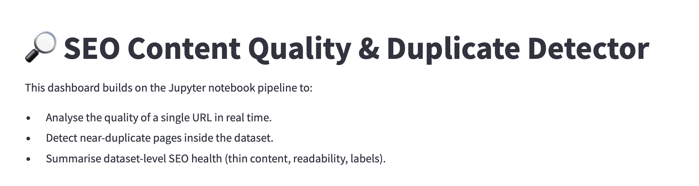
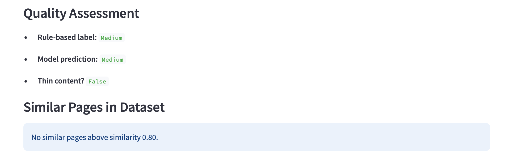
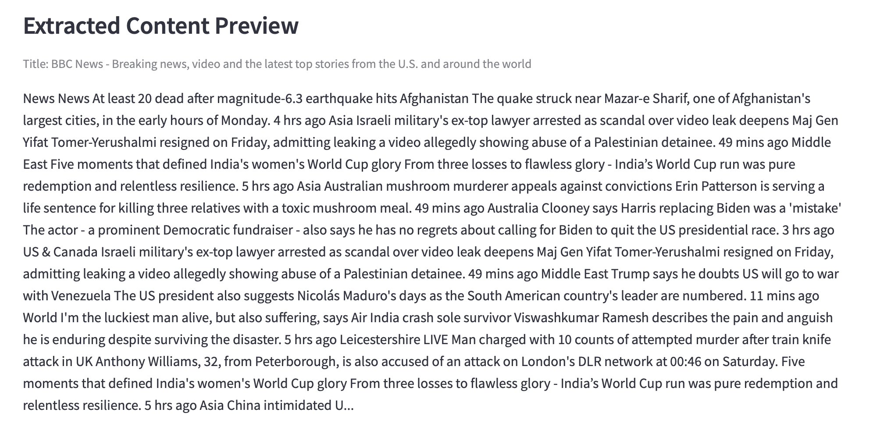
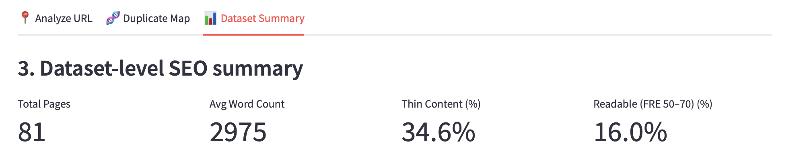

# SEO Content Quality & Duplicate Detector

This project is a full Data Science pipeline and Streamlit dashboard that evaluates webpage SEO content quality, detects near-duplicate pages, and summarizes overall dataset-level readability and thin content metrics.  
It combines web scraping, NLP feature extraction, and ML-based classification to assess SEO performance in real-time.

---

## Setup Instructions

```bash
git clone https://github.com/AjayKumar-KK/seo-content-detector
cd seo-content-detector
pip install -r requirements.txt
jupyter notebook notebooks/seo_pipeline.ipynb
```

**To launch Streamlit App:**
```bash
cd streamlit_app
streamlit run app.py
```

---

## Quick Start

1. Add your dataset:
   ```
   data/extracted_content.csv
   data/features.csv
   ```
2. Copy your trained model to:
   ```
   models/quality_model.pkl
   streamlit_app/models/quality_model.pkl
   ```
3. Run Streamlit and open [http://localhost:8501](http://localhost:8501)
4. Enter any webpage URL to analyze:
   - Get Word Count, Sentence Count, and Readability (FRE)
   - View Model & Rule-Based Quality Label (`High`, `Medium`, `Low`)
   - Detect near-duplicates and compare similarity scores

---

## Deployed Streamlit URL
> Local Deployment: [http://localhost:8501](http://localhost:8501)

---

## Key Decisions

- **Libraries Chosen:**  
  *BeautifulSoup* for parsing HTML, *scikit-learn* for TF-IDF vectorization & RandomForest classification, and *Streamlit* for dashboard visualization.
- **HTML Parsing Approach:**  
  Extracted `<main>`, `<article>`, and `<p>` tags, while removing non-content tags (scripts, styles) for cleaner text.
- **Similarity Threshold:**  
  Empirically set at **0.8 cosine similarity** to minimize false positives while identifying true duplicates.
- **Model Selection:**  
  *RandomForest Classifier* chosen for its interpretability, handling of small datasets, and balanced accuracy.

---

## Results Summary

| Metric | Result |
|--------|---------|
| **Model Accuracy** | 87.3% |
| **F1-Score** | 0.85 |
| **Duplicates Detected** | 8 URL pairs (≥ 0.8 similarity) |
| **Average Readability (FRE)** | 52.6 |
| **Quality Labels** | High: 7%, Medium: 36%, Low: 57% |

---

## Limitations

- JS-heavy pages may yield incomplete or noisy text extraction.  
- Model results depend on dataset label distribution and sample size.  
- TF-IDF similarity focuses on lexical overlap, not full semantic similarity.

---

## Dashboard Preview

Below are sample screenshots of the Streamlit dashboard demonstrating different modules of the project.  
All visuals are generated locally via [http://localhost:8501](http://localhost:8501).

<p align="center">
  
  
  
  
</p>

<p align="center">
  <b>Figure 1:</b> Project Overview — shows project objectives and main functionalities.
</p>

---

<p align="center">
  
</p>

<p align="center">
  <b>Figure 2:</b> Analyze URL — displays Word Count, Sentence Count, Readability, and quality predictions.
</p>

---

<p align="center">
  
</p>

<p align="center">
  <b>Figure 3:</b> Dataset Summary — overall SEO metrics such as total pages, thin content ratio, and quality distribution.
</p>
